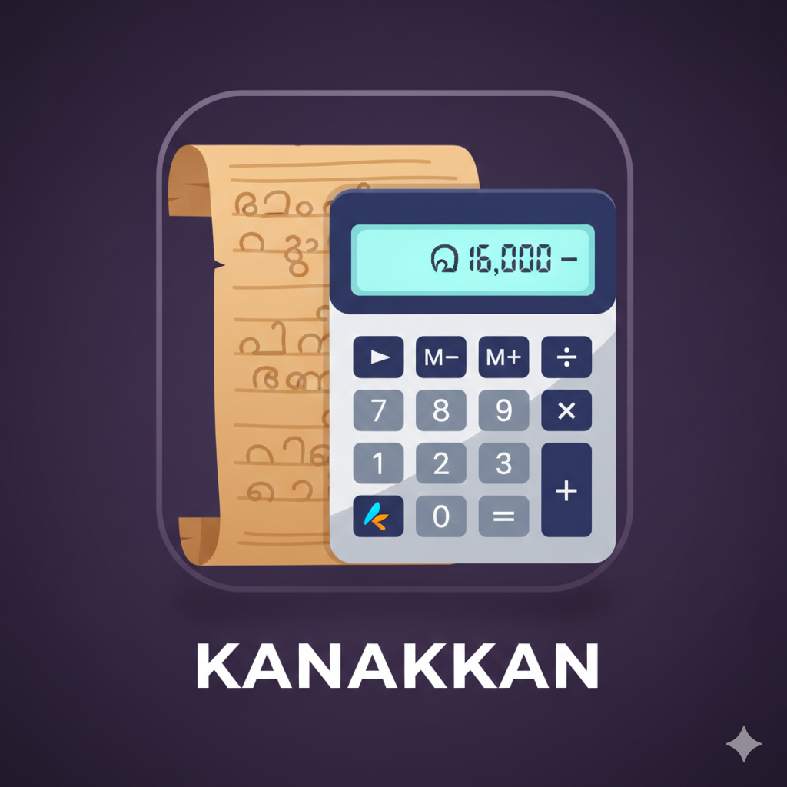

<p align="center">
  
</p>

<h1 align="center">Kanakkan (കണക്കൻ)</h1>
<p align="center">A private, offline-first personal finance manager — built with Flutter.</p>

<p align="center">
  
  
  
  
</p>

---

## Overview

**Kanakkan** (Malayalam for *Accountant*) is a 100 % offline personal finance app. All data lives on your device — no cloud, no accounts, no subscriptions. It is designed for users who want full control over their financial data with a polished, intuitive UI.

---

## Features

### 💰 Transactions
- Add income, expense, and transfer transactions
- **Bulk entry mode** — log multiple expense rows in one go
- Attach notes to any transaction
- Edit or delete transactions at any time
- Full transaction history with search and filter

### 🏦 Accounts & Wallets
- Multiple accounts (bank, cash, etc.) with custom initial balances
- **Wallet system** — allocate portions of income into named spending wallets (e.g., *Groceries*, *Rent*, *Entertainment*)
- Move money between wallets
- Real-time wallet balance tracking

### 📊 Budget Management
- Set monthly spending budgets per category
- Visual progress bars — see how much of each budget is used
- **Copy budget** from any previous month with one tap
- Overspent / remaining indicators

### 📈 Analysis & Insights
- **Monthly & yearly** views switchable with arrow navigation
- Income vs. expense trend bar chart
- Category breakdown pie chart with drill-down details
- Subcategory drill-down
- Savings rate gauge
- Daily spending line chart with peak-day detection
- All chart data shown in an interactive summary table

### 🏷️ Categories & Subcategories
- Fully custom income and expense categories
- Subcategory support under any category
- Wallet-to-category linking for smart budget tracking

### 💼 Salary Split
- Dedicated salary income flow
- **Automatically distribute** a salary amount across wallets as you enter it
- Remaining balance shown in real time as you type
- Save distribution templates for recurring months

### 📤 Export & Backup
- **Export to CSV** — full transaction list with date, account, category, amount, note
- **Export to PDF** — formatted report with header, table, and totals
- Both exports support **date-range filtering**
- **Backup** — export entire database as a single `.db` file
- **Restore** — import a backup file to restore all data
- Share exports directly via system share sheet

### 🔒 Security
- **4-digit PIN** lock screen on every app open
- **Biometric authentication** (fingerprint / face) as alternative to PIN
- **Change PIN** securely — requires current PIN before allowing change
- PIN stored in `FlutterSecureStorage` (device-encrypted, never leaves device)

### 🗑️ Delete & Reset
- Full data wipe from the drawer — clears all transactions, accounts, categories, budgets, and salary data

---

## Tech Stack

| Layer | Technology |
|---|---|
| Framework | Flutter 3.x / Dart 3.x |
| State Management | Provider (`ChangeNotifier`) |
| Database | SQLite via `sqflite` |
| Security | `flutter_secure_storage`, `local_auth` |
| Charts | `fl_chart` |
| PDF generation | `pdf` |
| CSV export | `csv` |
| File picker | `file_picker` |
| Sharing | `share_plus` |
| Number formatting | `intl` (en_IN locale) |
| Unique IDs | `uuid` |

---

## Project Structure

```
lib/
├── core/
│   ├── security/          # SecurityService — PIN & biometric
│   └── utils/             # AppTheme, formatAmt(), routing, validation
├── data/
│   ├── models/            # SQLite row models
│   ├── repositories/      # DAOs — transactions, accounts, categories, budgets
│   └── services/          # BackupService, ExportService (CSV & PDF)
├── domain/
│   └── entities/          # Pure domain entities (TransactionEntity, etc.)
├── presentation/
│   ├── dialogs/           # All modal dialogs and bottom sheets
│   ├── handlers/          # BackupRestoreHandler, ExportHandler — orchestration
│   ├── providers/         # LedgerProvider, CategoryProvider, BudgetProvider,
│   │                      #   AnalysisProvider, AppStateProvider, …
│   ├── screens/           # Full screens (Dashboard, Analysis, Budget, …)
│   └── widgets/           # Reusable widget components
└── main.dart
```

---

<p align="center">Made with ♥ in Keralam by <a href="https://www.linkedin.com/in/nithinjk28/">Nithin JK</a></p>
